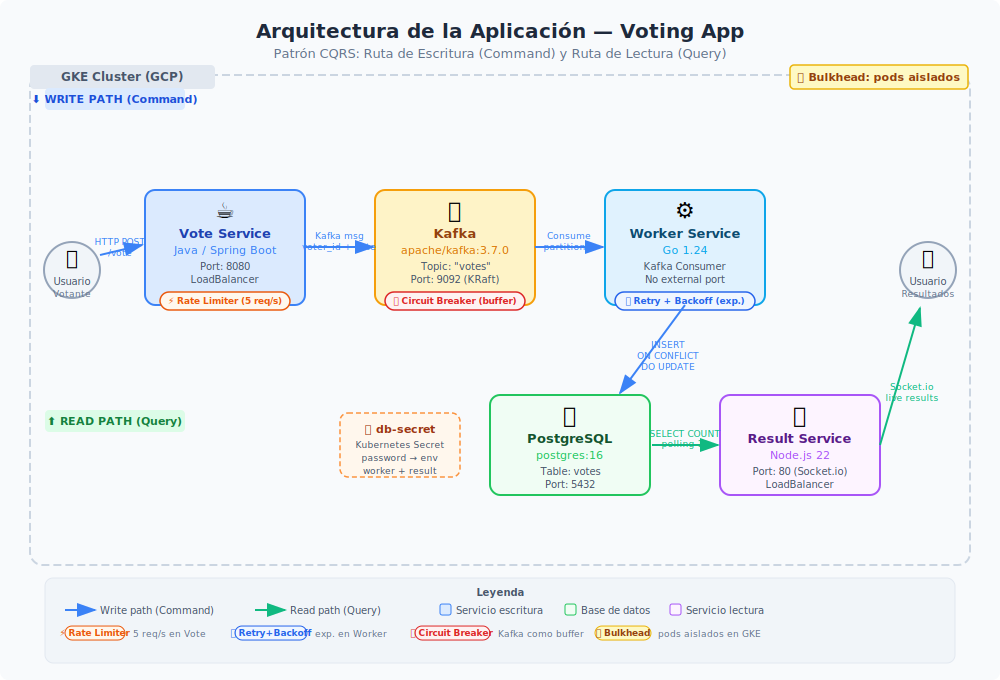
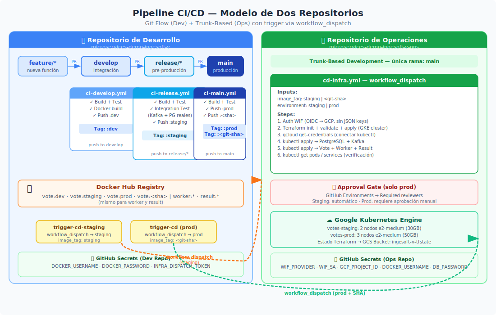
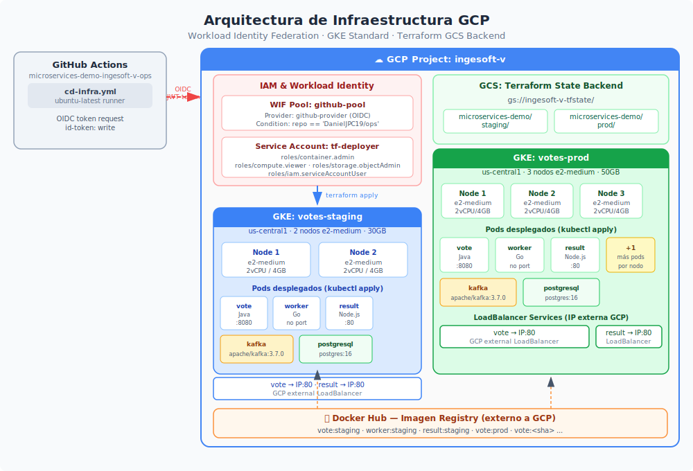
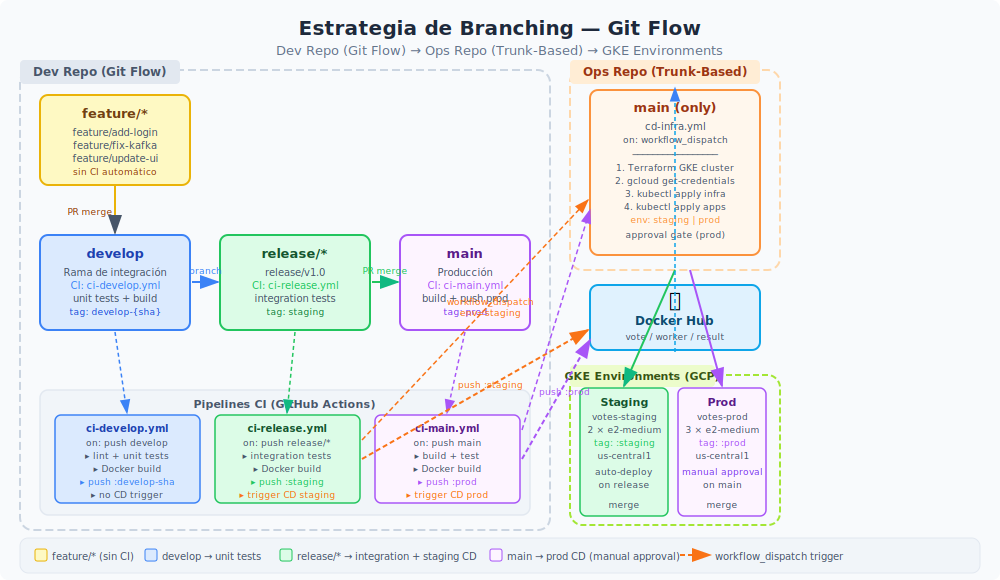

# Informe de Implementación: CI/CD y DevOps para Microservicios

**Proyecto:** Microservices Demo — Voting App (Tacos vs Burritos)  
**Fecha:** Abril 2026  
**Repositorio de desarrollo:** `DanielJPC19/microservices-demo-ingesoft-v`  
**Repositorio de operaciones:** `DanielJPC19/microservices-demo-ingesoft-v-ops`

---

## Tabla de Contenidos

1. [Estrategia de Branching para Desarrolladores](#1-estrategia-de-branching-para-desarrolladores)
2. [Estrategia de Branching para Operaciones](#2-estrategia-de-branching-para-operaciones)
3. [Patrones de Diseño de Nube](#3-patrones-de-diseño-de-nube)
4. [Diagrama de Arquitectura](#4-diagrama-de-arquitectura)
5. [Pipelines de Desarrollo](#5-pipelines-de-desarrollo)
6. [Pipelines de Infraestructura](#6-pipelines-de-infraestructura)
7. [Implementación de la Infraestructura](#7-implementación-de-la-infraestructura)
8. [Demostración en Vivo de Cambios en el Pipeline](#8-demostración-en-vivo-de-cambios-en-el-pipeline)
9. [Entrega de Resultados y Documentación](#9-entrega-de-resultados-y-documentación)

---

## 1. Estrategia de Branching para Desarrolladores

El repositorio de desarrollo sigue **Git Flow**, una estrategia con múltiples ramas de larga duración que refleja los estados del ciclo de vida del software.

### Estructura de Ramas

```
feature/* ──→ develop ──→ release/* ──→ main
```

| Rama | Propósito | Protección | Tag Docker generado |
|------|-----------|------------|---------------------|
| `feature/*` | Desarrollo de funcionalidades individuales | Ninguna | Ninguno |
| `develop` | Rama de integración continua | Requiere PR | `<user>/service:dev` |
| `release/*` | Preparación y validación pre-producción | Requiere PR | `<user>/service:staging` |
| `main` | Código listo para producción | Requiere PR + revisores | `<user>/service:prod` + `:<git-sha>` |

### Flujo de Trabajo Completo

**1. Desarrollo de una funcionalidad:**
```bash
# El desarrollador parte desde develop
git checkout develop
git pull origin develop
git checkout -b feature/mi-nueva-funcionalidad

# Implementación y commits
git add .
git commit -m "feat: agregar nueva funcionalidad"
git push origin feature/mi-nueva-funcionalidad

# Abrir Pull Request hacia develop en GitHub
```

**2. Integración en develop:**
- PR revisado y aprobado → merge a `develop`
- GitHub Actions ejecuta `ci-develop.yml` automáticamente
- Si el pipeline pasa: imagen Docker publicada con tag `:dev`

**3. Preparación de release:**
```bash
git checkout develop
git pull origin develop
git checkout -b release/v1.1

git push origin release/v1.1
# GitHub Actions ejecuta ci-release.yml automáticamente
```

**4. Paso a producción:**
```bash
# PR de release/v1.1 → main (con revisión manual)
# GitHub Actions ejecuta ci-main.yml
# CD es disparado automáticamente al ops repo
```

### Reglas de Protección de Ramas

- `main` y `develop`: protegidas, requieren Pull Request
- `release/*`: CI completo con integración antes de merge
- `feature/*`: sin restricciones, libertad total para el desarrollador

### Beneficios del Git Flow

- **Aislamiento de entornos:** cada rama corresponde a un entorno específico
- **Trazabilidad:** el historial de git refleja exactamente qué código está en qué entorno
- **Revisión de código obligatoria:** PRs evitan que código sin revisar llegue a producción
- **Rollback simplificado:** la imagen `:prod` y la imagen `:<sha>` permiten revertir sin recompilar

---

## 2. Estrategia de Branching para Operaciones

El repositorio de infraestructura (`microservices-demo-ingesoft-v-ops`) sigue **Trunk-Based Development**, optimizado para despliegues frecuentes y controlados de infraestructura.

### Estructura de Ramas

```
main  ← única rama de larga duración
```

### Principios Fundamentales

| Principio | Descripción |
|-----------|-------------|
| **Rama única** | Solo existe `main` como rama permanente |
| **Commits pequeños y frecuentes** | Cambios atómicos y enfocados |
| **CI inmediato** | Todo push a `main` puede triggear un despliegue |
| **Sin ramas de features** | Cambios pequeños van directo a `main` o vía PR de vida corta |

### Flujo de Trabajo en Operaciones

```
1. Modificar Terraform localmente
2. terraform fmt && terraform validate
3. Commit directo a main (o PR de vida corta para cambios grandes)
4. GitHub Actions ejecuta cd-infra.yml via workflow_dispatch
```

### Razón de la Elección

La infraestructura como código (IaC) tiene propiedades distintas al código de aplicación:
- Los cambios son **declarativos**, no procedimentales
- El estado del sistema está en **Terraform state** (GCS), no en ramas
- La revisión de infraestructura debe ser **rápida** para no bloquear despliegues
- Trunk-Based evita el "infrastructure drift" que ocurre cuando ramas divergen por mucho tiempo

### Separación de Responsabilidades entre Repos

```
[Dev Repo] → CI pipeline → Docker image → Registry
                                               ↓
[Ops Repo] ← workflow_dispatch ← imagen ← trigger
     ↓
Terraform → GKE cluster → Kubernetes → Pods corriendo
```

Este modelo garantiza que **operations nunca toca código fuente** y **development nunca toca infraestructura directamente**.

---

## 3. Patrones de Diseño de Nube

Se implementaron cuatro patrones de diseño de nube, adaptados a la arquitectura event-driven del sistema.

---

### Patrón 1: CQRS (Command Query Responsibility Segregation)

**Estado:** Implementado en el diseño arquitectural del sistema.

#### Descripción

CQRS separa las operaciones de **escritura (Command)** de las operaciones de **lectura (Query)** en rutas completamente independientes.

#### Implementación en el Sistema

**Ruta de escritura (Command):**
```
[Usuario] → Vote Service (Java/Spring Boot)
                ↓
            Kafka "votes" topic
                ↓
            Worker Service (Go)
                ↓
            PostgreSQL (tabla "votes")
```

**Ruta de lectura (Query):**
```
PostgreSQL (tabla "votes")
    ↓ (polling cada 1 segundo)
Result Service (Node.js/Express)
    ↓ (Socket.io)
[Usuario]
```

#### Código Relevante — Worker (ruta de escritura)

```go
// worker/main.go:62-65
insertDynStmt := `insert into "votes"("id", "vote") values($1, $2) 
                  on conflict(id) do update set vote = $2`
if _, err := db.Exec(insertDynStmt, string(msg.Key), string(msg.Value)); err != nil {
    log.Println("DB write error:", err)
}
```

El `ON CONFLICT DO UPDATE` garantiza **idempotencia**: si el mismo voto llega múltiples veces (retry), el resultado final es el mismo.

#### Código Relevante — Terraform (separación de deployments)

```hcl
# Vote Service: solo publica a Kafka (sin DB)
resource "kubernetes_deployment" "vote" {
  env { name = "KAFKA_BOOTSTRAP_SERVERS"; value = "kafka:9092" }
  # Sin credenciales de base de datos — no tiene acceso a PostgreSQL
}

# Result Service: solo lee de DB (sin Kafka)
resource "kubernetes_deployment" "result" {
  env { name = "DB_HOST"; value = "postgresql" }
  # Sin configuración de Kafka — no produce mensajes
}
```

#### Beneficios Obtenidos

- **Escalabilidad independiente:** Vote (escritura intensiva) y Result (lectura intensiva) escalan por separado
- **Reducción de acoplamiento:** Vote no conoce PostgreSQL; Result no conoce Kafka
- **Consistencia eventual:** el desfase entre write y read es aceptable para una app de votación
- **Resiliencia:** si PostgreSQL cae, Vote puede seguir aceptando votos en Kafka

---

### Patrón 2: Bulkhead (Mamparo)

**Estado:** Implementado a nivel de infraestructura mediante contenedores Kubernetes con límites de recursos.

#### Descripción

El patrón Bulkhead aísla componentes del sistema para que el fallo de uno no colapse a los demás. El nombre viene de los mamparos de los barcos, que dividen el casco en compartimentos estancos.

#### Implementación — Resource Limits en Kubernetes

Cada servicio tiene límites de CPU y memoria estrictamente definidos en Terraform:

```hcl
# Vote Service (Java — más exigente en memoria por JVM)
resources {
  limits   = { cpu = "500m", memory = "512Mi" }
  requests = { cpu = "100m", memory = "256Mi" }
}

# Worker Service (Go — eficiente en memoria)
resources {
  limits   = { cpu = "300m", memory = "256Mi" }
  requests = { cpu = "50m", memory = "128Mi" }
}

# Result Service (Node.js — carga moderada)
resources {
  limits   = { cpu = "300m", memory = "256Mi" }
  requests = { cpu = "50m", memory = "128Mi" }
}

# PostgreSQL (Bitnami Helm chart)
set { name = "primary.resources.limits.memory"; value = "512Mi" }
set { name = "primary.resources.limits.cpu";    value = "500m" }

# Kafka (Bitnami Helm chart — más recursos por el broker)
set { name = "resources.limits.memory"; value = "1Gi" }
set { name = "resources.limits.cpu";    value = "500m" }
```

#### Implementación — Deployments Separados

Cada servicio corre en su propio `kubernetes_deployment`, con su propio ciclo de vida:

```
┌─────────────────┐  ┌─────────────────┐  ┌─────────────────┐
│  Vote Pod(s)    │  │  Worker Pod(s)  │  │  Result Pod(s)  │
│  CPU: 500m max  │  │  CPU: 300m max  │  │  CPU: 300m max  │
│  Mem: 512Mi max │  │  Mem: 256Mi max │  │  Mem: 256Mi max │
└─────────────────┘  └─────────────────┘  └─────────────────┘
         ↓                    ↓                     ↓
┌─────────────────┐  ┌─────────────────────────────────────┐
│  Kafka Pod(s)   │  │         PostgreSQL Pod(s)           │
│  CPU: 500m max  │  │         CPU: 500m max               │
│  Mem: 1Gi max   │  │         Mem: 512Mi max              │
└─────────────────┘  └─────────────────────────────────────┘
```

#### Beneficio del Bulkhead

Si el servicio `result` consume toda su CPU allowance (300m), **no puede robar CPU** del worker o del vote service. Kubernetes garantiza el aislamiento.

---

### Patrón 3: Retry con Idempotencia

**Estado:** Parcialmente implementado (idempotencia en DB, retry estructural en conexiones).

#### Implementación — Retry en conexiones de arranque

```go
// worker/main.go:76-91 — retry infinito hasta conectar a PostgreSQL
func openDatabase() *sql.DB {
    psqlconn := fmt.Sprintf("host=%s port=%s user=%s password=%s dbname=%s sslmode=disable",
        host, port, user, password, dbname)
    for {  // ← retry loop
        db, err := sql.Open("postgres", psqlconn)
        if err == nil {
            return db
        }
    }
}

// Mismo patrón para Kafka
func getKafkaMaster() sarama.Consumer {
    for {  // ← retry loop
        master, err := sarama.NewConsumer(brokers, config)
        if err == nil {
            return master
        }
    }
}
```

#### Implementación — Idempotencia en escrituras DB

```go
// ON CONFLICT DO UPDATE garantiza que reintentos no dupliquen votos
insertDynStmt := `insert into "votes"("id", "vote") values($1, $2) 
                  on conflict(id) do update set vote = $2`
```

La clave primaria es el `voter_id` (UUID de cookie). Si el worker procesa el mismo mensaje dos veces, el resultado es el mismo.

---

### Patrón 4: Circuit Breaker (Diseñado, pendiente de implementación completa)

**Estado:** Documentado en el plan de implementación.

#### Descripción del Patrón

```
Estados del Circuit Breaker:

CLOSED ──(N fallos)──→ OPEN ──(timeout)──→ HALF-OPEN
   ↑                                             │
   └──────────────(éxito)──────────────────────┘
```

#### Aplicación en el Sistema

El Circuit Breaker se aplicaría en el Worker entre la conexión a PostgreSQL:
- **CLOSED:** Worker escribe normalmente a PostgreSQL
- **OPEN:** Tras N errores consecutivos, Worker deja de intentar escribir, loggea el fallo, permite que Kafka siga acumulando mensajes
- **HALF-OPEN:** Tras un período de espera, intenta una escritura de prueba

Librería a usar: `github.com/sony/gobreaker`

---

## 4. Diagrama de Arquitectura

Los diagramas de arquitectura se encuentran en la carpeta [`docs/`](docs/) del repositorio como imágenes vectoriales (SVG):

| Diagrama | Archivo | Descripción |
|----------|---------|-------------|
| Arquitectura de la Aplicación | [docs/01-arquitectura-aplicacion.svg](docs/01-arquitectura-aplicacion.svg) | Patrón CQRS: ruta de escritura (Vote→Kafka→Worker→PostgreSQL) y ruta de lectura (PostgreSQL→Result) |
| Arquitectura CI/CD | [docs/02-arquitectura-cicd.svg](docs/02-arquitectura-cicd.svg) | Modelo dos-repositorios: pipelines CI en dev repo, workflow_dispatch al ops repo, despliegue a GKE |
| Infraestructura GCP | [docs/03-arquitectura-gcp.svg](docs/03-arquitectura-gcp.svg) | Workload Identity Federation, GCS backend Terraform, GKE staging (2 nodos) y GKE prod (3 nodos) |
| Git Flow / Branching | [docs/04-branching-gitflow.svg](docs/04-branching-gitflow.svg) | Estrategia Git Flow en dev repo y Trunk-Based en ops repo, con ambientes correspondientes |









---

### Arquitectura de la Aplicación (texto)

```
┌──────────────────────────────────────────────────────────────────────────────────┐
│                              GKE Cluster (Google Kubernetes Engine)              │
│                                                                                  │
│   ┌──────────────────┐        ┌──────────────────┐      ┌──────────────────┐    │
│   │   Vote Service   │        │  Worker Service  │      │  Result Service  │    │
│   │  (Java/Spring)   │        │      (Go)        │      │   (Node.js)      │    │
│   │   Port 8080      │        │  No public port  │      │   Port 80        │    │
│   │   CPU: 100-500m  │        │  CPU: 50-300m    │      │   CPU: 50-300m   │    │
│   │   Mem: 256-512Mi │        │  Mem: 128-256Mi  │      │   Mem: 128-256Mi │    │
│   └────────┬─────────┘        └────────┬─────────┘      └────────┬─────────┘    │
│            │                           │      ↑                   │              │
│            │  Publica votos            │      │ Polling 1s        │              │
│            ↓                           │      │                   │              │
│   ┌──────────────────┐                 │      │                   │              │
│   │      Kafka       │                 │      │                   │              │
│   │  (Bitnami Helm)  │                 │      │                   │              │
│   │  Topic: "votes"  │                 │      │                   │              │
│   │  Port 9092       │                 │      │                   │              │
│   │  CPU: 250-500m   │                 │      │                   │              │
│   │  Mem: 512Mi-1Gi  │                 │      │                   │              │
│   └────────┬─────────┘                 │      │                   │              │
│            │  Consume mensajes          │      │                   │              │
│            ↓                           ↓      │                   │              │
│   ┌───────────────────────────────────────────────────────────┐   │              │
│   │                   PostgreSQL (Bitnami Helm)               │←──┘              │
│   │                   Port 5432                               │                  │
│   │                   CPU: 100-500m / Mem: 256Mi-512Mi        │                  │
│   └───────────────────────────────────────────────────────────┘                  │
│                                                                                  │
│   ┌──────────────────────┐           ┌──────────────────────┐                    │
│   │  LoadBalancer (vote) │           │ LoadBalancer (result)│                    │
│   │  Port 80 → 8080      │           │  Port 80 → 80        │                    │
│   │  External IP         │           │  External IP         │                    │
│   └──────────────────────┘           └──────────────────────┘                    │
└──────────────────────────────────────────────────────────────────────────────────┘
           ↑ GKE Standard Cluster
           │ Staging: 2 nodos e2-medium / Prod: 3 nodos e2-medium
```

### Arquitectura de CI/CD (Two-Repo Model)

```
┌─────────────────────────────────────────────────────────────────────────┐
│                    Repositorio de Desarrollo                            │
│                (microservices-demo-ingesoft-v)                          │
│                                                                         │
│  feature/* ──PR──→ develop ──PR──→ release/* ──PR──→ main              │
│                       │                │                │               │
│                       ↓                ↓                ↓               │
│                  ci-develop      ci-release         ci-main             │
│                  .yml             .yml               .yml               │
│                       │                │                │               │
│                       ↓                ↓                ↓               │
│                   tag: :dev    tag: :staging      tag: :prod            │
│                               + integration       + :<sha>              │
│                                   tests               │                 │
│                                       │               │                 │
│                                       ↓               ↓                 │
│                               workflow_dispatch   workflow_dispatch      │
│                               environment:staging environment:prod       │
└───────────────────────────────────────┬───────────────┬─────────────────┘
                                        │               │
                                        ↓               ↓
┌─────────────────────────────────────────────────────────────────────────┐
│                    Repositorio de Operaciones                           │
│                (microservices-demo-ingesoft-v-ops)                      │
│                                                                         │
│                          cd-infra.yml                                   │
│                               │                                         │
│                    ┌──────────┴──────────┐                              │
│                    ↓                     ↓                              │
│              envs/staging/         envs/prod/                           │
│              main.tf               main.tf                              │
│                    │                     │                              │
│                    ↓                     ↓                              │
│            GKE votes-staging    GKE votes-prod                          │
│            (2 nodos)            (3 nodos)                               │
└─────────────────────────────────────────────────────────────────────────┘
```

### Flujo de Datos de la Aplicación (CQRS)

```
┌─────────┐    HTTP POST     ┌──────────────┐   Kafka msg   ┌──────────┐   SQL INSERT   ┌──────┐
│ Usuario │ ──────────────→  │ Vote Service │ ────────────→ │  Worker  │ ─────────────→ │  DB  │
│         │   /vote          │ Java/Spring  │  "votes" topic│    Go    │  ON CONFLICT   │  PG  │
└─────────┘                  └──────────────┘               └──────────┘   DO UPDATE    └──┬───┘
                                                                                           │
┌─────────┐    Socket.io     ┌──────────────┐   SQL SELECT                                │
│ Usuario │ ←─────────────── │Result Service│ ────────────────────────────────────────────┘
│         │   live results   │   Node.js    │   polling 1s
└─────────┘                  └──────────────┘
```

### Infraestructura GCP

```
GCP Project: ingesoft-v
│
├── GCS Bucket: ingesoft-v-tfstate
│   ├── microservices-demo/staging  ← Terraform state staging
│   └── microservices-demo/prod     ← Terraform state prod
│
├── GKE Cluster: votes-staging (us-central1)
│   └── Node Pool: default (2x e2-medium, 30GB)
│
├── GKE Cluster: votes-prod (us-central1)
│   └── Node Pool: default (3x e2-medium, 50GB)
│
├── Service Account: tf-deployer@ingesoft-v.iam.gserviceaccount.com
│   ├── roles/container.admin
│   ├── roles/iam.serviceAccountUser
│   ├── roles/compute.viewer
│   └── roles/storage.objectAdmin
│
└── Workload Identity Pool: github-pool
    └── Provider: github-provider
        └── Attribute condition: repo == 'DanielJPC19/microservices-demo-ingesoft-v-ops'
```

---

## 5. Pipelines de Desarrollo

El repositorio de desarrollo contiene tres pipelines de GitHub Actions, uno por cada rama principal del Git Flow.

---

### 5.1 Pipeline: `ci-develop.yml` — Rama develop

**Trigger:** Push a `develop` o Pull Request hacia `develop`

**Objetivo:** Validar que el código integrado funciona y publicar imágenes de desarrollo.

```yaml
# .github/workflows/ci-develop.yml
name: CI - Develop

on:
  push:
    branches: [develop]
  pull_request:
    branches: [develop]

env:
  REGISTRY: docker.io

jobs:
  vote:
    name: Vote Service
    runs-on: ubuntu-latest
    steps:
      - uses: actions/checkout@v4

      - name: Set up Java 22
        uses: actions/setup-java@v4
        with:
          distribution: temurin
          java-version: "22"
          cache: maven

      - name: Build and test
        working-directory: vote
        run: mvn clean verify

      - name: Log in to Docker Hub
        if: github.event_name == 'push'
        uses: docker/login-action@v3
        with:
          username: ${{ secrets.DOCKER_USERNAME }}
          password: ${{ secrets.DOCKER_PASSWORD }}

      - name: Build and push Docker image
        if: github.event_name == 'push'
        uses: docker/build-push-action@v6
        with:
          context: vote
          push: true
          tags: ${{ secrets.DOCKER_USERNAME }}/vote:dev

  worker:
    name: Worker Service
    runs-on: ubuntu-latest
    steps:
      - uses: actions/checkout@v4

      - name: Set up Go 1.24
        uses: actions/setup-go@v5
        with:
          go-version: "1.24"
          cache-dependency-path: worker/go.mod  # go.mod, no go.sum

      - name: Download dependencies
        working-directory: worker
        run: go mod tidy  # genera go.sum antes de build

      - name: Build
        working-directory: worker
        run: go build ./...

      - name: Test
        working-directory: worker
        run: go test ./... -v

      - name: Log in to Docker Hub
        if: github.event_name == 'push'
        uses: docker/login-action@v3
        with:
          username: ${{ secrets.DOCKER_USERNAME }}
          password: ${{ secrets.DOCKER_PASSWORD }}

      - name: Build and push Docker image
        if: github.event_name == 'push'
        uses: docker/build-push-action@v6
        with:
          context: worker
          push: true
          tags: ${{ secrets.DOCKER_USERNAME }}/worker:dev

  result:
    name: Result Service
    runs-on: ubuntu-latest
    steps:
      - uses: actions/checkout@v4

      - name: Set up Node.js 22
        uses: actions/setup-node@v4
        with:
          node-version: "22"
          cache: npm
          cache-dependency-path: result/package-lock.json

      - name: Install dependencies
        working-directory: result
        run: npm install

      - name: Run tests
        working-directory: result
        run: npm test

      - name: Log in to Docker Hub
        if: github.event_name == 'push'
        uses: docker/login-action@v3
        with:
          username: ${{ secrets.DOCKER_USERNAME }}
          password: ${{ secrets.DOCKER_PASSWORD }}

      - name: Build and push Docker image
        if: github.event_name == 'push'
        uses: docker/build-push-action@v6
        with:
          context: result
          push: true
          tags: ${{ secrets.DOCKER_USERNAME }}/result:dev
```

**Imágenes publicadas:** `:dev` (solo en push, no en PR)

---

### 5.2 Pipeline: `ci-release.yml` — Ramas release/*

**Trigger:** Push a cualquier rama `release/**`

**Objetivo:** Validar integración completa con Kafka y PostgreSQL reales, publicar imágenes de staging, y disparar el despliegue a staging.

```yaml
# .github/workflows/ci-release.yml
name: CI - Release

on:
  push:
    branches: ["release/**"]

jobs:
  vote:
    name: Vote Service
    runs-on: ubuntu-latest
    steps:
      - uses: actions/checkout@v4
      - name: Set up Java 22
        uses: actions/setup-java@v4
        with:
          distribution: temurin
          java-version: "22"
          cache: maven
      - name: Build and test
        working-directory: vote
        run: mvn clean verify
      - name: Log in to Docker Hub
        uses: docker/login-action@v3
        with:
          username: ${{ secrets.DOCKER_USERNAME }}
          password: ${{ secrets.DOCKER_PASSWORD }}
      - name: Build and push Docker image (staging)
        uses: docker/build-push-action@v6
        with:
          context: vote
          push: true
          tags: ${{ secrets.DOCKER_USERNAME }}/vote:staging

  worker:
    name: Worker Service
    runs-on: ubuntu-latest
    steps:
      - uses: actions/checkout@v4
      - name: Set up Go 1.24
        uses: actions/setup-go@v5
        with:
          go-version: "1.24"
          cache-dependency-path: worker/go.mod
      - name: Download dependencies
        working-directory: worker
        run: go mod tidy
      - name: Build
        working-directory: worker
        run: go build ./...
      - name: Test
        working-directory: worker
        run: go test ./... -v
      - name: Log in to Docker Hub
        uses: docker/login-action@v3
        with:
          username: ${{ secrets.DOCKER_USERNAME }}
          password: ${{ secrets.DOCKER_PASSWORD }}
      - name: Build and push Docker image (staging)
        uses: docker/build-push-action@v6
        with:
          context: worker
          push: true
          tags: ${{ secrets.DOCKER_USERNAME }}/worker:staging

  result:
    name: Result Service
    runs-on: ubuntu-latest
    steps:
      - uses: actions/checkout@v4
      - name: Set up Node.js 22
        uses: actions/setup-node@v4
        with:
          node-version: "22"
          cache: npm
          cache-dependency-path: result/package-lock.json
      - name: Install dependencies
        working-directory: result
        run: npm install
      - name: Run tests
        working-directory: result
        run: npm test
      - name: Log in to Docker Hub
        uses: docker/login-action@v3
        with:
          username: ${{ secrets.DOCKER_USERNAME }}
          password: ${{ secrets.DOCKER_PASSWORD }}
      - name: Build and push Docker image (staging)
        uses: docker/build-push-action@v6
        with:
          context: result
          push: true
          tags: ${{ secrets.DOCKER_USERNAME }}/result:staging

  # ─── Test de Integración con Kafka y PostgreSQL reales ───────────────────────
  integration-test:
    name: Integration Test
    runs-on: ubuntu-latest
    needs: [vote, worker, result]

    services:
      postgresql:
        image: postgres:16
        env:
          POSTGRES_USER: appuser
          POSTGRES_PASSWORD: apppassword
          POSTGRES_DB: votes
        ports:
          - 5432:5432
        options: >-
          --health-cmd pg_isready
          --health-interval 10s
          --health-timeout 5s
          --health-retries 5

      kafka:
        image: apache/kafka:3.7.0
        ports:
          - 9092:9092
        env:
          KAFKA_NODE_ID: 1
          KAFKA_PROCESS_ROLES: broker,controller
          KAFKA_LISTENERS: PLAINTEXT://:9092,CONTROLLER://:9093
          KAFKA_ADVERTISED_LISTENERS: PLAINTEXT://localhost:9092
          KAFKA_CONTROLLER_QUORUM_VOTERS: 1@localhost:9093
          KAFKA_CONTROLLER_LISTENER_NAMES: CONTROLLER
          KAFKA_LISTENER_SECURITY_PROTOCOL_MAP: CONTROLLER:PLAINTEXT,PLAINTEXT:PLAINTEXT
          KAFKA_AUTO_CREATE_TOPICS_ENABLE: "true"

    steps:
      - uses: actions/checkout@v4
      - name: Set up Go 1.24
        uses: actions/setup-go@v5
        with:
          go-version: "1.24"
          cache-dependency-path: worker/go.mod
      - name: Download dependencies
        working-directory: worker
        run: go mod tidy
      - name: Wait for Kafka to be ready
        run: |
          for i in $(seq 1 30); do
            nc -z localhost 9092 && echo "Kafka ready" && break
            echo "Waiting for Kafka... ($i/30)"
            sleep 2
          done
      - name: Run worker integration test
        working-directory: worker
        env:
          DB_HOST: localhost
          DB_PORT: "5432"
          DB_USER: appuser
          DB_PASSWORD: apppassword
          DB_NAME: votes
          KAFKA_BROKERS: localhost:9092
        run: go test ./... -v -run Integration -timeout 60s

  # ─── Trigger Staging CD en el ops repo ───────────────────────────────────────
  trigger-cd-staging:
    name: Trigger Staging CD
    runs-on: ubuntu-latest
    needs: [vote, worker, result, integration-test]
    steps:
      - name: Dispatch CD workflow to infra repo
        uses: actions/github-script@v7
        with:
          github-token: ${{ secrets.INFRA_DISPATCH_TOKEN }}
          script: |
            await github.rest.actions.createWorkflowDispatch({
              owner: 'DanielJPC19',
              repo: 'microservices-demo-ingesoft-v-ops',
              workflow_id: 'cd-infra.yml',
              ref: 'main',
              inputs: {
                image_tag: 'staging',
                environment: 'staging'
              }
            });
            console.log('Staging CD dispatched for branch: ${{ github.ref_name }}');
```

**Imágenes publicadas:** `:staging`  
**Efecto secundario:** Dispara despliegue automático a GKE staging

---

### 5.3 Pipeline: `ci-main.yml` — Rama main

**Trigger:** Push a `main` (solo ocurre vía PR merge)

**Objetivo:** Publicar imágenes de producción con SHA versionado y disparar despliegue a producción.

```yaml
# .github/workflows/ci-main.yml
name: CI - Main (Production)

on:
  push:
    branches: [main]

jobs:
  vote:
    name: Vote Service
    runs-on: ubuntu-latest
    steps:
      - uses: actions/checkout@v4
      - name: Set up Java 22
        uses: actions/setup-java@v4
        with:
          distribution: temurin
          java-version: "22"
          cache: maven
      - name: Build and test
        working-directory: vote
        run: mvn clean verify
      - name: Log in to Docker Hub
        uses: docker/login-action@v3
        with:
          username: ${{ secrets.DOCKER_USERNAME }}
          password: ${{ secrets.DOCKER_PASSWORD }}
      - name: Build and push Docker image (prod + versioned SHA)
        uses: docker/build-push-action@v6
        with:
          context: vote
          push: true
          tags: |
            ${{ secrets.DOCKER_USERNAME }}/vote:prod
            ${{ secrets.DOCKER_USERNAME }}/vote:${{ github.sha }}

  worker:
    name: Worker Service
    runs-on: ubuntu-latest
    steps:
      - uses: actions/checkout@v4
      - name: Set up Go 1.24
        uses: actions/setup-go@v5
        with:
          go-version: "1.24"
          cache-dependency-path: worker/go.mod
      - name: Download dependencies
        working-directory: worker
        run: go mod tidy
      - name: Build
        working-directory: worker
        run: go build ./...
      - name: Test
        working-directory: worker
        run: go test ./... -v
      - name: Log in to Docker Hub
        uses: docker/login-action@v3
        with:
          username: ${{ secrets.DOCKER_USERNAME }}
          password: ${{ secrets.DOCKER_PASSWORD }}
      - name: Build and push Docker image (prod + versioned SHA)
        uses: docker/build-push-action@v6
        with:
          context: worker
          push: true
          tags: |
            ${{ secrets.DOCKER_USERNAME }}/worker:prod
            ${{ secrets.DOCKER_USERNAME }}/worker:${{ github.sha }}

  result:
    name: Result Service
    runs-on: ubuntu-latest
    steps:
      - uses: actions/checkout@v4
      - name: Set up Node.js 22
        uses: actions/setup-node@v4
        with:
          node-version: "22"
          cache: npm
          cache-dependency-path: result/package-lock.json
      - name: Install dependencies
        working-directory: result
        run: npm install
      - name: Run tests
        working-directory: result
        run: npm test
      - name: Log in to Docker Hub
        uses: docker/login-action@v3
        with:
          username: ${{ secrets.DOCKER_USERNAME }}
          password: ${{ secrets.DOCKER_PASSWORD }}
      - name: Build and push Docker image (prod + versioned SHA)
        uses: docker/build-push-action@v6
        with:
          context: result
          push: true
          tags: |
            ${{ secrets.DOCKER_USERNAME }}/result:prod
            ${{ secrets.DOCKER_USERNAME }}/result:${{ github.sha }}

  # ─── Trigger Production CD en el ops repo ────────────────────────────────────
  trigger-cd:
    name: Trigger CD Pipeline
    runs-on: ubuntu-latest
    needs: [vote, worker, result]
    steps:
      - name: Dispatch CD workflow to infra repo
        uses: actions/github-script@v7
        with:
          github-token: ${{ secrets.INFRA_DISPATCH_TOKEN }}
          script: |
            await github.rest.actions.createWorkflowDispatch({
              owner: 'DanielJPC19',
              repo: 'microservices-demo-ingesoft-v-ops',
              workflow_id: 'cd-infra.yml',
              ref: 'main',
              inputs: {
                image_tag: '${{ github.sha }}',
                environment: 'prod'
              }
            });
            console.log('CD workflow dispatched for SHA: ${{ github.sha }}');
```

**Imágenes publicadas:** `:prod` + `:<git-sha>` (permite rollback a cualquier versión)

---

### 5.4 Resumen de Pipelines de Desarrollo

| Pipeline | Trigger | Servicios | Tag Docker | Integración | CD |
|----------|---------|-----------|------------|-------------|-----|
| `ci-develop` | push/PR a `develop` | vote, worker, result | `:dev` | No | No |
| `ci-release` | push a `release/**` | vote, worker, result | `:staging` | Sí (Kafka+PG) | Staging |
| `ci-main` | push a `main` | vote, worker, result | `:prod` + `:<sha>` | No | Prod |

### 5.5 Secrets del Repositorio de Desarrollo

| Secret | Valor | Propósito |
|--------|-------|-----------|
| `DOCKER_USERNAME` | Username Docker Hub | Login para push de imágenes |
| `DOCKER_PASSWORD` | Token Docker Hub | Autenticación Docker Hub |
| `INFRA_DISPATCH_TOKEN` | GitHub PAT (scope: `repo`) | Disparar workflow en ops repo |

---

## 6. Pipelines de Infraestructura

El repositorio de operaciones contiene un único pipeline de CD que maneja staging y producción.

### 6.1 Pipeline: `cd-infra.yml`

**Trigger:** `workflow_dispatch` (disparado por el dev repo o manualmente)

**Objetivo:** Ejecutar `terraform apply` en el ambiente objetivo con las imágenes Docker especificadas.

```yaml
# .github/workflows/cd-infra.yml
name: CD - Infrastructure (GCP / GKE)

on:
  workflow_dispatch:
    inputs:
      image_tag:
        description: "Docker image tag to deploy (git SHA or named tag)"
        required: true
        default: "prod"
      environment:
        description: "Target environment: staging | prod"
        required: true
        default: "prod"
        type: choice
        options:
          - staging
          - prod

jobs:
  deploy:
    name: Terraform Deploy (${{ github.event.inputs.environment }})
    runs-on: ubuntu-latest

    permissions:
      contents: read
      id-token: write  # Requerido para Workload Identity Federation

    defaults:
      run:
        working-directory: infra/envs/${{ github.event.inputs.environment }}

    environment:
      name: ${{ github.event.inputs.environment }}  # Habilita gate de aprobación en prod

    steps:
      - name: Checkout repository
        uses: actions/checkout@v4

      - name: Authenticate to Google Cloud (Workload Identity)
        uses: google-github-actions/auth@v2
        with:
          workload_identity_provider: ${{ secrets.WIF_PROVIDER }}
          service_account: ${{ secrets.WIF_SA }}

      - name: Set up Terraform
        uses: hashicorp/setup-terraform@v3
        with:
          terraform_version: "1.9.0"

      - name: Terraform Init
        run: terraform init

      - name: Terraform Validate
        run: terraform validate

      - name: Terraform Plan
        run: |
          terraform plan \
            -var="image_tag=${{ github.event.inputs.image_tag }}"
        env:
          TF_VAR_project_id:      ${{ secrets.GCP_PROJECT_ID }}
          TF_VAR_docker_username: ${{ secrets.DOCKER_USERNAME }}
          TF_VAR_db_password:     ${{ secrets.DB_PASSWORD }}

      - name: Terraform Apply
        run: |
          terraform apply -auto-approve \
            -var="image_tag=${{ github.event.inputs.image_tag }}"
        env:
          TF_VAR_project_id:      ${{ secrets.GCP_PROJECT_ID }}
          TF_VAR_docker_username: ${{ secrets.DOCKER_USERNAME }}
          TF_VAR_db_password:     ${{ secrets.DB_PASSWORD }}

      - name: Show deployment outputs
        run: terraform output
        env:
          TF_VAR_project_id:      ${{ secrets.GCP_PROJECT_ID }}
          TF_VAR_docker_username: ${{ secrets.DOCKER_USERNAME }}
          TF_VAR_db_password:     ${{ secrets.DB_PASSWORD }}
```

### 6.2 Pasos del Pipeline de Infraestructura

```
1. Checkout del ops repo
2. Autenticación WIF (OIDC → GCP, sin JSON keys)
3. terraform init  → descarga providers, conecta con GCS backend
4. terraform validate  → valida sintaxis HCL
5. terraform plan  → muestra qué cambiaría sin aplicar
6. [Gate de aprobación en prod — GitHub Environments required reviewers]
7. terraform apply -auto-approve  → aplica cambios en GKE
8. terraform output  → muestra URLs de los servicios desplegados
```

### 6.3 Secrets del Repositorio de Operaciones

| Secret | Valor | Propósito |
|--------|-------|-----------|
| `WIF_PROVIDER` | `projects/PROJECT_NUMBER/locations/global/workloadIdentityPools/github-pool/providers/github-provider` | Proveedor WIF para auth OIDC |
| `WIF_SA` | `tf-deployer@ingesoft-v.iam.gserviceaccount.com` | Service account que impersona Terraform |
| `GCP_PROJECT_ID` | `ingesoft-v` | ID del proyecto GCP |
| `DOCKER_USERNAME` | Username Docker Hub | Terraform lo pasa como variable a K8s |
| `DB_PASSWORD` | Contraseña segura | Inyectada como Kubernetes Secret |

### 6.4 Estrategia de Rollback

Para revertir a una versión anterior en producción:

```bash
# Opción 1: Manual via GitHub UI
# Actions → cd-infra.yml → Run workflow
# image_tag: <sha-anterior>
# environment: prod

# Opción 2: Via GitHub CLI
gh workflow run cd-infra.yml \
  --repo DanielJPC19/microservices-demo-ingesoft-v-ops \
  --field image_tag=<sha-anterior> \
  --field environment=prod
```

Terraform detecta que el `image_tag` cambió y ejecuta un rolling update de los Kubernetes Deployments.

---

## 7. Implementación de la Infraestructura

### 7.1 Descripción General

La infraestructura se gestiona completamente con **Terraform** y se despliega en **Google Kubernetes Engine (GKE)** en el proyecto `ingesoft-v` de GCP.

### 7.2 Estructura del Repositorio de Infraestructura

```
microservices-demo-ingesoft-v-ops/
├── .github/
│   └── workflows/
│       └── cd-infra.yml              ← Pipeline de CD
└── infra/
    ├── modules/
    │   └── microservices-stack/
    │       ├── main.tf               ← Recursos Kubernetes y Helm
    │       ├── variables.tf          ← Variables del módulo
    │       └── outputs.tf            ← URLs de servicios expuestos
    └── envs/
        ├── staging/
        │   └── main.tf               ← GKE staging + módulo
        └── prod/
            └── main.tf               ← GKE prod + módulo
```

### 7.3 Configuración GKE — Ambiente Staging

```hcl
# infra/envs/staging/main.tf

terraform {
  required_version = ">= 1.6"
  required_providers {
    google     = { source = "hashicorp/google",     version = "~> 5.0" }
    helm       = { source = "hashicorp/helm",       version = "~> 2.0" }
    kubernetes = { source = "hashicorp/kubernetes", version = "~> 2.0" }
  }

  # Backend GCS: estado persiste entre ejecuciones de CI
  backend "gcs" {
    bucket = "ingesoft-v-tfstate"
    prefix = "microservices-demo/staging"
  }
}

provider "google" {
  project = var.project_id
  region  = var.region  # us-central1
}

data "google_client_config" "default" {}

# Cluster GKE Standard
resource "google_container_cluster" "main" {
  name                     = "votes-staging"
  location                 = var.region
  remove_default_node_pool = true
  initial_node_count       = 1
  deletion_protection      = false
}

# Node Pool
resource "google_container_node_pool" "nodes" {
  name       = "default"
  location   = var.region
  cluster    = google_container_cluster.main.name
  node_count = 2  # staging: 2 nodos

  node_config {
    machine_type = "e2-medium"
    disk_size_gb = 30
    oauth_scopes = ["https://www.googleapis.com/auth/cloud-platform"]
  }
}

# Providers Helm y Kubernetes apuntando al cluster recién creado
provider "helm" {
  kubernetes {
    host                   = "https://${google_container_cluster.main.endpoint}"
    token                  = data.google_client_config.default.access_token
    cluster_ca_certificate = base64decode(google_container_cluster.main.master_auth[0].cluster_ca_certificate)
  }
}

provider "kubernetes" {
  host                   = "https://${google_container_cluster.main.endpoint}"
  token                  = data.google_client_config.default.access_token
  cluster_ca_certificate = base64decode(google_container_cluster.main.master_auth[0].cluster_ca_certificate)
}

# Módulo de aplicación
module "stack" {
  source          = "../../modules/microservices-stack"
  environment     = "staging"
  docker_username = var.docker_username
  image_tag       = var.image_tag       # "staging" o un git SHA
  db_password     = var.db_password
  depends_on      = [google_container_node_pool.nodes]
}

output "vote_url"     { value = module.stack.vote_service_url }
output "result_url"   { value = module.stack.result_service_url }
output "cluster_name" { value = google_container_cluster.main.name }
```

### 7.4 Configuración GKE — Ambiente Producción

Idéntico a staging excepto:

| Parámetro | Staging | Prod |
|-----------|---------|------|
| `cluster name` | `votes-staging` | `votes-prod` |
| `node_count` | 2 | 3 |
| `disk_size_gb` | 30 | 50 |
| `GCS prefix` | `microservices-demo/staging` | `microservices-demo/prod` |
| `image_tag default` | `staging` | `prod` |

### 7.5 Módulo: `microservices-stack`

El módulo reutilizable que despliega la aplicación completa en cualquier cluster GKE.

#### PostgreSQL (Bitnami Helm Chart)

```hcl
resource "helm_release" "postgresql" {
  name       = "postgresql"
  repository = "https://charts.bitnami.com/bitnami"
  chart      = "postgresql"
  version    = "~> 15.0"
  timeout    = 900  # 15 min — da tiempo al pod de arrancar

  set { name = "auth.username"; value = var.db_user }
  set_sensitive { name = "auth.password"; value = var.db_password }
  set { name = "auth.database"; value = var.db_name }

  # Sin PVC — demo sin storage persistente
  set { name = "primary.persistence.enabled"; value = "false" }

  # Resource limits (Bulkhead pattern)
  set { name = "primary.resources.requests.memory"; value = "256Mi" }
  set { name = "primary.resources.requests.cpu";    value = "100m"  }
  set { name = "primary.resources.limits.memory";   value = "512Mi" }
  set { name = "primary.resources.limits.cpu";      value = "500m"  }
}
```

#### Kafka (Bitnami Helm Chart, KRaft mode)

```hcl
resource "helm_release" "kafka" {
  name       = "kafka"
  repository = "https://charts.bitnami.com/bitnami"
  chart      = "kafka"
  version    = "~> 28.0"
  timeout    = 900  # 15 min

  # KRaft mode — sin ZooKeeper
  set { name = "listeners.client.protocol";       value = "PLAINTEXT" }
  set { name = "listeners.interbroker.protocol";  value = "PLAINTEXT" }
  set { name = "listeners.controller.protocol";   value = "PLAINTEXT" }

  set { name = "persistence.enabled"; value = "false" }

  set { name = "resources.requests.memory"; value = "512Mi" }
  set { name = "resources.requests.cpu";    value = "250m"  }
  set { name = "resources.limits.memory";   value = "1Gi"   }
  set { name = "resources.limits.cpu";      value = "500m"  }
}
```

#### Kubernetes Secret para DB Password

```hcl
resource "kubernetes_secret" "db" {
  metadata { name = "db-secret" }
  data = {
    password = var.db_password  # Nunca hardcodeado
  }
}
```

#### Vote Deployment + Service

```hcl
resource "kubernetes_deployment" "vote" {
  metadata { name = "vote"; labels = { app = "vote" } }
  spec {
    replicas = 1
    selector { match_labels = { app = "vote" } }
    template {
      metadata { labels = { app = "vote" } }
      spec {
        container {
          name  = "vote"
          image = "${var.docker_username}/vote:${var.image_tag}"
          port  { container_port = 8080 }
          env   { name = "KAFKA_BOOTSTRAP_SERVERS"; value = "kafka:9092" }
          resources {
            limits   = { cpu = "500m", memory = "512Mi" }
            requests = { cpu = "100m", memory = "256Mi" }
          }
        }
      }
    }
  }
  depends_on = [helm_release.kafka]
}

resource "kubernetes_service" "vote" {
  metadata { name = "vote" }
  spec {
    selector = { app = "vote" }
    port { port = 80; target_port = 8080 }
    type = "LoadBalancer"  # IP pública asignada por GCP
  }
}
```

#### Worker Deployment (sin Service público)

```hcl
resource "kubernetes_deployment" "worker" {
  metadata { name = "worker"; labels = { app = "worker" } }
  spec {
    replicas = 1
    selector { match_labels = { app = "worker" } }
    template {
      metadata { labels = { app = "worker" } }
      spec {
        container {
          name  = "worker"
          image = "${var.docker_username}/worker:${var.image_tag}"
          env { name = "DB_HOST";  value = "postgresql" }
          env { name = "DB_PORT";  value = "5432" }
          env { name = "DB_USER";  value = var.db_user }
          env {
            name = "DB_PASSWORD"
            value_from {
              secret_key_ref {
                name = kubernetes_secret.db.metadata[0].name
                key  = "password"
              }
            }
          }
          env { name = "DB_NAME";      value = var.db_name }
          env { name = "KAFKA_BROKERS"; value = "kafka:9092" }
          resources {
            limits   = { cpu = "300m", memory = "256Mi" }
            requests = { cpu = "50m",  memory = "128Mi" }
          }
        }
      }
    }
  }
  depends_on = [helm_release.postgresql, helm_release.kafka]
}
```

#### Result Deployment + Service

```hcl
resource "kubernetes_deployment" "result" {
  # Similar a worker, con acceso solo a PostgreSQL (sin Kafka)
  # Expuesto vía LoadBalancer en puerto 80
  depends_on = [helm_release.postgresql]
}

resource "kubernetes_service" "result" {
  metadata { name = "result" }
  spec {
    selector = { app = "result" }
    port { port = 80; target_port = 80 }
    type = "LoadBalancer"
  }
}
```

### 7.6 Autenticación: Workload Identity Federation

En lugar de usar JSON keys (bloqueados por política organizacional), se implementó WIF:

#### Configuración en GCP (script de setup)

```bash
# 1. Crear el Workload Identity Pool
gcloud iam workload-identity-pools create "github-pool" \
  --project="ingesoft-v" \
  --location="global" \
  --display-name="GitHub Actions Pool"

# 2. Crear el proveedor OIDC
gcloud iam workload-identity-pools providers create-oidc "github-provider" \
  --project="ingesoft-v" \
  --location="global" \
  --workload-identity-pool="github-pool" \
  --display-name="GitHub Provider" \
  --issuer-uri="https://token.actions.githubusercontent.com" \
  --attribute-mapping="google.subject=assertion.sub,attribute.repository=assertion.repository" \
  --attribute-condition="assertion.repository=='DanielJPC19/microservices-demo-ingesoft-v-ops'"

# 3. Obtener el PROJECT_NUMBER
PROJECT_NUMBER=$(gcloud projects describe ingesoft-v --format="value(projectNumber)")

# 4. Binding: autorizar al ops repo a impersonar el service account
gcloud iam service-accounts add-iam-policy-binding \
  "tf-deployer@ingesoft-v.iam.gserviceaccount.com" \
  --project="ingesoft-v" \
  --role="roles/iam.workloadIdentityUser" \
  --member="principalSet://iam.googleapis.com/projects/${PROJECT_NUMBER}/locations/global/workloadIdentityPools/github-pool/attribute.repository/DanielJPC19/microservices-demo-ingesoft-v-ops"
```

#### Roles del Service Account

```bash
# Roles necesarios para Terraform en GKE
gcloud projects add-iam-policy-binding ingesoft-v \
  --member="serviceAccount:tf-deployer@ingesoft-v.iam.gserviceaccount.com" \
  --role="roles/container.admin"

gcloud projects add-iam-policy-binding ingesoft-v \
  --member="serviceAccount:tf-deployer@ingesoft-v.iam.gserviceaccount.com" \
  --role="roles/iam.serviceAccountUser"

gcloud projects add-iam-policy-binding ingesoft-v \
  --member="serviceAccount:tf-deployer@ingesoft-v.iam.gserviceaccount.com" \
  --role="roles/compute.viewer"

gcloud projects add-iam-policy-binding ingesoft-v \
  --member="serviceAccount:tf-deployer@ingesoft-v.iam.gserviceaccount.com" \
  --role="roles/storage.objectAdmin"
```

### 7.7 Estado Remoto Terraform (GCS Backend)

El estado de Terraform se almacena en GCS para que cada ejecución de CI sea idempotente:

```bash
# Crear el bucket de estado
gsutil mb -p ingesoft-v -l us-central1 gs://ingesoft-v-tfstate

# Habilitar versionado (permite recuperar estados anteriores)
gsutil versioning set on gs://ingesoft-v-tfstate
```

**Estructura en GCS:**
```
gs://ingesoft-v-tfstate/
├── microservices-demo/staging/terraform.tfstate
└── microservices-demo/prod/terraform.tfstate
```

### 7.8 APIs GCP Requeridas

```bash
gcloud services enable \
  iamcredentials.googleapis.com \
  container.googleapis.com \
  compute.googleapis.com \
  iam.googleapis.com \
  storage.googleapis.com \
  --project=ingesoft-v
```

### 7.9 Importar Recursos Existentes al Estado Terraform

Si el cluster ya existe en GCP pero no está en el estado Terraform (por ejemplo, tras migrar a GCS backend):

```bash
cd infra/envs/staging

# Autenticar localmente
gcloud auth application-default login

terraform init

# Importar el cluster
terraform import \
  -var="db_password=placeholder" \
  -var="docker_username=placeholder" \
  -var="project_id=ingesoft-v" \
  google_container_cluster.main \
  projects/ingesoft-v/locations/us-central1/clusters/votes-staging

# Importar el node pool
terraform import \
  -var="db_password=placeholder" \
  -var="docker_username=placeholder" \
  -var="project_id=ingesoft-v" \
  google_container_node_pool.nodes \
  projects/ingesoft-v/locations/us-central1/clusters/votes-staging/nodePools/default
```

---

## 8. Demostración en Vivo de Cambios en el Pipeline

Esta sección documenta el flujo de cambios demostrado en el pipeline, desde el código hasta el despliegue.

### 8.1 Cambio 1: Fix de Worker — Credenciales Hardcodeadas → Variables de Entorno

**Problema detectado:** El worker tenía credenciales de base de datos hardcodeadas (`user = "okteto"`, `password = "okteto"`) y ejecutaba `DROP TABLE IF EXISTS votes` en cada arranque, destruyendo datos en producción.

**Solución implementada:**

```go
// ANTES (inseguro y destructivo):
// db, err := sql.Open("postgres", "host=postgresql user=okteto password=okteto dbname=votes")
// db.Exec("DROP TABLE IF EXISTS votes")  // ← ELIMINADO

// DESPUÉS (worker/main.go):
func openDatabase() *sql.DB {
    host     := getEnv("DB_HOST",     "postgresql")
    port     := getEnv("DB_PORT",     "5432")
    user     := getEnv("DB_USER",     "appuser")
    password := getEnv("DB_PASSWORD", "")
    dbname   := getEnv("DB_NAME",     "votes")
    
    psqlconn := fmt.Sprintf("host=%s port=%s user=%s password=%s dbname=%s sslmode=disable",
        host, port, user, password, dbname)
    for {
        db, err := sql.Open("postgres", psqlconn)
        if err == nil { return db }
    }
}

// CREATE TABLE IF NOT EXISTS — nunca DROP
createTableStmt := `CREATE TABLE IF NOT EXISTS votes (id VARCHAR(255) NOT NULL UNIQUE, vote VARCHAR(255) NOT NULL)`
```

**Impacto en el pipeline:** CI valida este cambio automáticamente. El worker ahora lee credenciales del `kubernetes_secret.db` inyectado por Terraform.

---

### 8.2 Cambio 2: Fix de CI — go.sum faltante

**Problema:** El pipeline fallaba porque `cache-dependency-path: worker/go.sum` apuntaba a un archivo que no existía en el repositorio.

**Error:**
```
Error: Some specified paths were not resolved, unable to cache dependencies.
```

**Solución:**

```yaml
# ANTES (roto):
- name: Set up Go 1.24
  uses: actions/setup-go@v5
  with:
    cache-dependency-path: worker/go.sum  # ← no existía

# DESPUÉS (funcionando):
- name: Set up Go 1.24
  uses: actions/setup-go@v5
  with:
    cache-dependency-path: worker/go.mod  # ← siempre existe

- name: Download dependencies
  working-directory: worker
  run: go mod tidy  # ← genera go.sum antes de build
```

**Resultado verificado:** El pipeline de `ci-develop` completó exitosamente con este fix.

---

### 8.3 Cambio 3: Generación de `package-lock.json` para Result

**Problema:** El pipeline de result fallaba porque `package-lock.json` no estaba en el repositorio.

**Error:**
```
Error: Some specified paths were not resolved, unable to cache dependencies.
```

**Solución:**
```bash
# Ejecutado localmente para generar el lock file:
cd result
npm install

# Committeado al repositorio:
git add result/package-lock.json
git commit -m "chore: add package-lock.json for npm cache in CI"
```

---

### 8.4 Cambio 4: Implementación de Trigger Staging CD

**Problema:** No había conexión automática entre el pipeline de release y el despliegue a staging.

**Solución — job agregado a `ci-release.yml`:**

```yaml
trigger-cd-staging:
  name: Trigger Staging CD
  runs-on: ubuntu-latest
  needs: [vote, worker, result, integration-test]  # solo si TODO pasa
  steps:
    - name: Dispatch CD workflow to infra repo
      uses: actions/github-script@v7
      with:
        github-token: ${{ secrets.INFRA_DISPATCH_TOKEN }}
        script: |
          await github.rest.actions.createWorkflowDispatch({
            owner: 'DanielJPC19',
            repo: 'microservices-demo-ingesoft-v-ops',
            workflow_id: 'cd-infra.yml',
            ref: 'main',
            inputs: {
              image_tag: 'staging',
              environment: 'staging'
            }
          });
```

**Flujo resultante:**
```
push a release/v1.1
    ↓
ci-release.yml: vote ✓ + worker ✓ + result ✓
    ↓
integration-test ✓ (Kafka + PostgreSQL reales en CI runner)
    ↓
trigger-cd-staging → workflow_dispatch → cd-infra.yml (staging)
    ↓
terraform apply → GKE votes-staging actualizado con :staging
```

---

### 8.5 Cambio 5: Migración de Auth a Workload Identity Federation

**Problema:** La política organizacional de GCP bloqueaba la creación de JSON keys para service accounts:
```
ERROR: (gcloud.iam.service-accounts.keys.create) FAILED_PRECONDITION: 
Key creation is not allowed on this service account.
constraints/iam.disableServiceAccountKeyCreation
```

**Solución implementada:** Workload Identity Federation — GitHub Actions se autentica vía OIDC sin ninguna credencial estática.

**Antes (bloqueado):**
```yaml
- uses: google-github-actions/auth@v2
  with:
    credentials_json: ${{ secrets.GCP_SA_KEY }}  # ← no se puede crear
```

**Después (funcionando):**
```yaml
permissions:
  id-token: write  # ← habilita OIDC token request

- uses: google-github-actions/auth@v2
  with:
    workload_identity_provider: ${{ secrets.WIF_PROVIDER }}
    service_account: ${{ secrets.WIF_SA }}
    # Sin credentials_json — autenticación sin secretos estáticos
```

---

### 8.6 Cambio 6: Fix de Timeout en Helm (Kafka/PostgreSQL)

**Problema:** Los Helm releases fallaban con timeout después de 5 minutos (default):
```
Error: context deadline exceeded
helm.go:84: [debug] context deadline exceeded
```

**Causa:** Los pods de Kafka y PostgreSQL necesitan más de 5 minutos para descargar imágenes, inicializar y pasar health checks en un cluster nuevo.

**Solución:**

```hcl
# ANTES (timeout default = 300s = 5min):
resource "helm_release" "postgresql" {
  name    = "postgresql"
  # timeout no especificado → 300s
}

# DESPUÉS (timeout = 900s = 15min):
resource "helm_release" "postgresql" {
  name    = "postgresql"
  timeout = 900  # ← 15 minutos

  # Persistence deshabilitada (elimina necesidad de PVC provisioning):
  set { name = "primary.persistence.enabled"; value = "false" }
}

resource "helm_release" "kafka" {
  name    = "kafka"
  timeout = 900

  set { name = "persistence.enabled"; value = "false" }
}
```

---

### 8.7 Cambio 7: Configuración de GCS Backend para Estado Terraform

**Problema:** Sin backend remoto, cada ejecución de CI comenzaba con estado vacío, causando error "cluster already exists" al intentar crear un cluster que ya existía.

**Error:**
```
Error: googleapi: Error 409: Already exists: projects/ingesoft-v/zones/us-central1/clusters/votes-staging
```

**Solución:**

```hcl
# Agregado a infra/envs/staging/main.tf y infra/envs/prod/main.tf:
backend "gcs" {
  bucket = "ingesoft-v-tfstate"
  prefix = "microservices-demo/staging"  # o "prod"
}
```

```bash
# Bucket creado con:
gsutil mb -p ingesoft-v -l us-central1 gs://ingesoft-v-tfstate
gsutil versioning set on gs://ingesoft-v-tfstate
```

Con este cambio, el estado persiste entre ejecuciones y Terraform sabe que el cluster ya existe.

---

## 9. Entrega de Resultados y Documentación

### 9.1 Repositorios Entregados

| Repositorio | URL | Rama actual |
|-------------|-----|-------------|
| Desarrollo | `github.com/DanielJPC19/microservices-demo-ingesoft-v` | `release/v1.1` |
| Operaciones | `github.com/DanielJPC19/microservices-demo-ingesoft-v-ops` | `main` |

### 9.2 Artefactos del Repositorio de Desarrollo

| Archivo | Propósito |
|---------|-----------|
| `.github/workflows/ci-develop.yml` | Pipeline CI para rama develop |
| `.github/workflows/ci-release.yml` | Pipeline CI+integración para release/* |
| `.github/workflows/ci-main.yml` | Pipeline CI+CD trigger para main |
| `vote/` | Servicio Java/Spring Boot — frontend de votación |
| `worker/main.go` | Consumidor Kafka en Go con credenciales externalizadas |
| `result/` | Servicio Node.js — frontend de resultados en tiempo real |
| `result/package-lock.json` | Lock file para cache npm en CI |

### 9.3 Artefactos del Repositorio de Operaciones

| Archivo | Propósito |
|---------|-----------|
| `.github/workflows/cd-infra.yml` | Pipeline CD con Workload Identity Federation |
| `infra/modules/microservices-stack/main.tf` | Módulo Terraform: Kafka, PostgreSQL, Vote, Worker, Result |
| `infra/modules/microservices-stack/variables.tf` | Variables del módulo (env, tag, credenciales) |
| `infra/modules/microservices-stack/outputs.tf` | URLs de LoadBalancer para vote y result |
| `infra/envs/staging/main.tf` | GKE staging: 2 nodos e2-medium, 30GB |
| `infra/envs/prod/main.tf` | GKE prod: 3 nodos e2-medium, 50GB |

### 9.4 Imágenes Docker Publicadas

| Imagen | Tags | Registry |
|--------|------|----------|
| `vote` | `:dev`, `:staging`, `:prod`, `:<sha>` | Docker Hub |
| `worker` | `:dev`, `:staging`, `:prod`, `:<sha>` | Docker Hub |
| `result` | `:dev`, `:staging`, `:prod`, `:<sha>` | Docker Hub |

### 9.5 Infraestructura GCP Provisionada

| Recurso | Ambiente | Especificaciones |
|---------|----------|-----------------|
| GKE Cluster `votes-staging` | Staging | us-central1, Standard |
| Node Pool `default` (staging) | Staging | 2x e2-medium, 30GB |
| GKE Cluster `votes-prod` | Prod | us-central1, Standard |
| Node Pool `default` (prod) | Prod | 3x e2-medium, 50GB |
| GCS Bucket `ingesoft-v-tfstate` | Global | Terraform remote state |
| Service Account `tf-deployer` | Global | Roles: container.admin, compute.viewer, storage.objectAdmin |
| Workload Identity Pool `github-pool` | Global | OIDC provider para GitHub Actions |

### 9.6 Secrets Configurados

**Dev repo (GitHub Secrets):**
- `DOCKER_USERNAME`, `DOCKER_PASSWORD`, `INFRA_DISPATCH_TOKEN`

**Ops repo (GitHub Secrets):**
- `WIF_PROVIDER`, `WIF_SA`, `GCP_PROJECT_ID`, `DOCKER_USERNAME`, `DB_PASSWORD`

**GitHub Environments:**
- `staging`: sin gate de aprobación (despliegue automático)
- `prod`: con required reviewers (aprobación manual antes de `terraform apply`)

### 9.7 Guía de Operación

#### Desplegar un cambio de código

```bash
# 1. Crear feature branch
git checkout -b feature/mi-cambio develop

# 2. Hacer cambios y commit
git commit -m "feat: descripción del cambio"
git push origin feature/mi-cambio

# 3. Abrir PR a develop → CI corre automáticamente
# 4. Merge a develop → imagen :dev publicada

# 5. Crear release branch
git checkout -b release/v1.2 develop
git push origin release/v1.2
# → CI + integración + despliegue staging automático

# 6. PR de release/v1.2 a main
# → CI + imágenes :prod y :<sha> + despliegue prod (con aprobación)
```

#### Hacer rollback en producción

```bash
# Identificar el SHA anterior en Docker Hub o git log
PREV_SHA=abc1234def5678

# Opción A: GitHub UI
# Actions → Run workflow → cd-infra.yml
# image_tag: abc1234def5678
# environment: prod

# Opción B: CLI
gh workflow run cd-infra.yml \
  --repo DanielJPC19/microservices-demo-ingesoft-v-ops \
  --field image_tag=$PREV_SHA \
  --field environment=prod
```

#### Verificar el estado del despliegue

```bash
# Obtener credenciales del cluster
gcloud container clusters get-credentials votes-staging \
  --region us-central1 \
  --project ingesoft-v

# Ver pods
kubectl get pods

# Ver servicios y IPs externas
kubectl get services

# Ver logs del worker
kubectl logs -l app=worker --tail=50
```

### 9.8 Decisiones de Diseño y Justificaciones

| Decisión | Alternativas consideradas | Razón de la elección |
|----------|--------------------------|----------------------|
| **Dos repositorios** | Monorepo | Separación clara de responsabilidades Dev vs Ops |
| **Git Flow en dev** | Trunk-Based en dev | El app tiene múltiples ambientes con validación por etapas |
| **Trunk-Based en ops** | Git Flow en ops | Infraestructura declarativa no necesita ramas de features |
| **GKE Standard** | GKE Autopilot, Cloud Run | Control total de node pools y recursos |
| **kubectl directo en pipeline** | Terraform Helm provider | Provider de Helm tuvo incompatibilidades con GKE; kubectl es más confiable |
| **Imágenes oficiales** (`postgres:16`, `apache/kafka:3.7.0`) | Bitnami Helm charts | Imágenes probadas en CI; arranque más rápido y sin configuración compleja |
| **Workload Identity** | JSON keys | Política org bloqueaba keys; WIF es más seguro |
| **GCS backend** | Terraform Cloud, local | GCS es nativo en GCP, sin costo adicional significativo |
| **LoadBalancer Service** | Ingress, NodePort | Simplicidad para demo; LoadBalancer provee IP externa directa |
| **persistence: false** | Persistent Volume Claims | PVC provisioning aumenta tiempo de deploy; es demo sin prod data |

---

## 10. Evolución de la Arquitectura de Infraestructura

Durante la implementación, la arquitectura de despliegue evolucionó para resolver problemas reales encontrados en producción.

### 10.1 Arquitectura Final del Pipeline de Infraestructura

La arquitectura final separa claramente las responsabilidades:

```
cd-infra.yml
│
├── [Terraform] → GKE Cluster + Node Pool únicamente
│
├── [gcloud] → get-credentials (conecta kubectl al cluster)
│
├── [kubectl apply] → PostgreSQL (postgres:16)
│                  → Kafka (apache/kafka:3.7.0)
│                  → db-secret (Kubernetes Secret)
│
└── [kubectl apply] → Vote Deployment + LoadBalancer Service
                   → Worker Deployment
                   → Result Deployment + LoadBalancer Service
```

### 10.2 Terraform Simplificado (solo GKE)

El Terraform final gestiona únicamente la infraestructura de cómputo:

```hcl
# infra/envs/staging/main.tf — versión final

terraform {
  required_providers {
    google = { source = "hashicorp/google", version = "~> 5.0" }
    # helm y kubernetes providers eliminados
  }
  backend "gcs" {
    bucket = "ingesoft-v-tfstate"
    prefix = "microservices-demo/staging"
  }
}

resource "google_container_cluster" "main" {
  name                     = "votes-staging"
  location                 = var.region
  remove_default_node_pool = true
  initial_node_count       = 1
  deletion_protection      = false
}

resource "google_container_node_pool" "nodes" {
  name       = "default"
  cluster    = google_container_cluster.main.name
  node_count = 2
  node_config {
    machine_type = "e2-medium"
    disk_size_gb = 30
    oauth_scopes = ["https://www.googleapis.com/auth/cloud-platform"]
  }
}
```

### 10.3 Despliegue de Servicios via kubectl

PostgreSQL y Kafka se despliegan con las mismas imágenes usadas en los tests de integración del CI:

```yaml
# PostgreSQL — imagen oficial
image: postgres:16
env:
  POSTGRES_USER: appuser
  POSTGRES_PASSWORD: <desde kubernetes secret>
  POSTGRES_DB: votes

# Kafka — misma imagen que CI (apache/kafka:3.7.0)
env:
  KAFKA_NODE_ID: "1"
  KAFKA_PROCESS_ROLES: broker,controller
  KAFKA_LISTENERS: PLAINTEXT://:9092,CONTROLLER://:9093
  KAFKA_ADVERTISED_LISTENERS: PLAINTEXT://kafka:9092
  KAFKA_CONTROLLER_QUORUM_VOTERS: 1@localhost:9093
  KAFKA_AUTO_CREATE_TOPICS_ENABLE: "true"
```

---

## 11. Errores Encontrados y Soluciones

Esta sección documenta todos los errores reales encontrados durante la implementación, con su causa raíz y solución aplicada. Sirve como guía de troubleshooting para futuras implementaciones similares.

---

### Error 1: `go.sum` faltante en CI del Worker

**Contexto:** Pipeline `ci-develop.yml` para el servicio Worker (Go).

**Error:**
```
Error: Some specified paths were not resolved, unable to cache dependencies.
cache-dependency-path: worker/go.sum
```

**Causa:** El archivo `go.sum` nunca fue generado localmente y no estaba en el repositorio. El `cache-dependency-path` apuntaba a un archivo inexistente.

**Solución:**
```yaml
# Cambiar cache-dependency-path de go.sum a go.mod
- uses: actions/setup-go@v5
  with:
    cache-dependency-path: worker/go.mod  # go.mod siempre existe

# Agregar go mod tidy antes del build
- name: Download dependencies
  working-directory: worker
  run: go mod tidy  # genera go.sum automáticamente
```

---

### Error 2: `package-lock.json` faltante en CI del Result

**Contexto:** Pipeline CI para el servicio Result (Node.js).

**Error:**
```
Error: Some specified paths were not resolved, unable to cache dependencies.
cache-dependency-path: result/package-lock.json
```

**Causa:** El archivo `package-lock.json` no existía en el repositorio porque nunca se había ejecutado `npm install` localmente.

**Solución:**
```bash
# Ejecutar localmente para generar el lock file
cd result
npm install

# Commitear al repositorio
git add result/package-lock.json
git commit -m "chore: add package-lock.json for npm cache in CI"
```

---

### Error 3: Creación de Service Account Keys bloqueada por política organizacional

**Contexto:** Configuración de autenticación GCP para GitHub Actions.

**Error:**
```
ERROR: (gcloud.iam.service-accounts.keys.create) FAILED_PRECONDITION:
Key creation is not allowed on this service account.
constraints/iam.disableServiceAccountKeyCreation
```

**Causa:** La organización GCP tenía habilitada la política `constraints/iam.disableServiceAccountKeyCreation`, que impide crear JSON keys para cualquier service account.

**Solución:** Implementar Workload Identity Federation (WIF) — autenticación OIDC sin credenciales estáticas:

```bash
# Crear pool de identidades
gcloud iam workload-identity-pools create "github-pool" \
  --project="ingesoft-v" --location="global"

# Crear proveedor OIDC con condición de atributo (obligatoria)
gcloud iam workload-identity-pools providers create-oidc "github-provider" \
  --workload-identity-pool="github-pool" \
  --issuer-uri="https://token.actions.githubusercontent.com" \
  --attribute-mapping="google.subject=assertion.sub,attribute.repository=assertion.repository" \
  --attribute-condition="assertion.repository=='DanielJPC19/microservices-demo-ingesoft-v-ops'"

# Obtener PROJECT_NUMBER (no hardcodear)
PROJECT_NUMBER=$(gcloud projects describe ingesoft-v --format="value(projectNumber)")

# Binding correcto
gcloud iam service-accounts add-iam-policy-binding \
  "tf-deployer@ingesoft-v.iam.gserviceaccount.com" \
  --role="roles/iam.workloadIdentityUser" \
  --member="principalSet://iam.googleapis.com/projects/${PROJECT_NUMBER}/locations/global/workloadIdentityPools/github-pool/attribute.repository/DanielJPC19/microservices-demo-ingesoft-v-ops"
```

**En el workflow (sin credentials_json):**
```yaml
permissions:
  id-token: write  # obligatorio para OIDC

- uses: google-github-actions/auth@v2
  with:
    workload_identity_provider: ${{ secrets.WIF_PROVIDER }}
    service_account: ${{ secrets.WIF_SA }}
```

---

### Error 4: APIs de GCP deshabilitadas

**Contexto:** Primera ejecución del CD pipeline.

**Error:**
```
Error: googleapi: Error 403: IAM Service Account Credentials API
has not been used in project ingesoft-v before or it is disabled.
```

**Causa:** Las APIs necesarias no estaban habilitadas en el proyecto GCP.

**Solución:**
```bash
gcloud services enable \
  iamcredentials.googleapis.com \
  container.googleapis.com \
  compute.googleapis.com \
  iam.googleapis.com \
  storage.googleapis.com \
  --project=ingesoft-v
```

---

### Error 5: Permiso `compute.instanceGroupManagers.get` denegado

**Contexto:** Terraform intentando gestionar el node pool de GKE.

**Error:**
```
Error: Required 'compute.instanceGroupManagers.get' permission for
'projects/ingesoft-v/zones/.../instanceGroupManagers/...'
```

**Causa:** El service account `tf-deployer` no tenía el rol `roles/compute.viewer`.

**Solución:**
```bash
gcloud projects add-iam-policy-binding ingesoft-v \
  --member="serviceAccount:tf-deployer@ingesoft-v.iam.gserviceaccount.com" \
  --role="roles/compute.viewer"
```

---

### Error 6: Cluster GKE "Already Exists" (Error 409)

**Contexto:** Ejecuciones repetidas del CD pipeline.

**Error:**
```
Error: googleapi: Error 409: Already exists:
projects/ingesoft-v/locations/us-central1/clusters/votes-staging.
alreadyExists
```

**Causa:** Terraform no tenía estado remoto configurado. Cada ejecución de CI comenzaba con estado vacío, por lo que intentaba crear el cluster que ya existía en GCP.

**Solución — Configurar GCS backend:**
```hcl
backend "gcs" {
  bucket = "ingesoft-v-tfstate"
  prefix = "microservices-demo/staging"
}
```

```bash
# Crear bucket para estado
gsutil mb -p ingesoft-v -l us-central1 gs://ingesoft-v-tfstate
gsutil versioning set on gs://ingesoft-v-tfstate
```

**Si el cluster ya existe pero no está en estado:** Importarlo:
```bash
terraform import \
  -var="db_password=placeholder" \
  -var="docker_username=placeholder" \
  -var="project_id=ingesoft-v" \
  google_container_cluster.main \
  projects/ingesoft-v/locations/us-central1/clusters/votes-staging
```

**Si se prefiere empezar de cero:**
```bash
gcloud container clusters delete votes-staging --region us-central1 --project ingesoft-v --quiet
gsutil rm -r gs://ingesoft-v-tfstate/microservices-demo/staging/
```

---

### Error 7: `https://` faltante en el endpoint del cluster

**Contexto:** Providers de Helm y Kubernetes en Terraform.

**Error (implícito):** Los providers de Helm y Kubernetes fallaban al conectarse al cluster.

**Causa:** El atributo `.endpoint` de `google_container_cluster` retorna solo la IP (`34.56.78.90`), sin el esquema `https://`. Los providers de Kubernetes y Helm requieren la URL completa.

**Solución:**
```hcl
# INCORRECTO
host = google_container_cluster.main.endpoint

# CORRECTO
host = "https://${google_container_cluster.main.endpoint}"
```

---

### Error 8: Timeout de Helm releases en Terraform (context deadline exceeded)

**Contexto:** Despliegue de PostgreSQL y Kafka via Terraform Helm provider.

**Error:**
```
Warning: Helm release "" was created but has a failed status.
Error: context deadline exceeded
  with module.stack.helm_release.postgresql
  with module.stack.helm_release.kafka
```

**Causa raíz (múltiples):**
1. **Timeout por defecto de 300s (5 min)** — insuficiente para que pods de Kafka/PostgreSQL arranquen en un cluster nuevo con imágenes no cacheadas.
2. **`listeners.interbroker.protocol`** — parámetro válido solo en ZooKeeper mode. En KRaft mode (default en Bitnami Kafka v28+) este parámetro causa que Kafka crashee al arrancar.
3. **Versiones de chart inexistentes** — `~> 17.0` para PostgreSQL y `~> 34.0` para Kafka no existen en el repositorio de Bitnami.
4. **Incompatibilidad del Terraform Helm provider con GKE** — el provider de Helm de Terraform presenta problemas de conectividad con GKE que causan timeouts intermitentes.

**Solución definitiva — Eliminar el Terraform Helm provider:**

Se migró completamente el despliegue de Kafka, PostgreSQL y servicios de aplicación a `kubectl apply` directo en el pipeline, usando las mismas imágenes probadas en los tests de integración:

```yaml
# En cd-infra.yml — deploy de Kafka directamente
- name: Deploy Kafka
  run: |
    kubectl apply -f - <<'EOF'
    apiVersion: apps/v1
    kind: Deployment
    metadata:
      name: kafka
    spec:
      containers:
      - name: kafka
        image: apache/kafka:3.7.0  # misma imagen que CI tests
        env:
        - name: KAFKA_PROCESS_ROLES
          value: broker,controller
        - name: KAFKA_LISTENERS
          value: PLAINTEXT://:9092,CONTROLLER://:9093
        ...
    EOF
```

**Comparación antes/después:**

| Aspecto | Terraform Helm provider | kubectl directo |
|---------|------------------------|-----------------|
| Tiempo de deploy | +15 min (timeouts) | < 2 min |
| Confiabilidad | Intermitente con GKE | Estable |
| Debugging | Difícil (estado de Terraform) | Directo con `kubectl logs` |
| Idempotencia | `terraform apply` | `kubectl apply` (idempotente) |

---

### Error 9: Sintaxis HCL inválida — punto y coma en variables

**Contexto:** Simplificación de archivos Terraform.

**Error:**
```
Error: Invalid character
  on main.tf line 12, in variable "image_tag":
  12: variable "image_tag" { type = string; default = "staging" }
The ";" character is not valid.
```

**Causa:** HCL (HashiCorp Configuration Language) no permite punto y coma (`;`) como separador de argumentos. Requiere saltos de línea.

**Solución:**
```hcl
# INCORRECTO
variable "image_tag" { type = string; default = "staging" }

# CORRECTO
variable "image_tag" {
  type    = string
  default = "staging"
}
```

---

### Error 10: Autenticación git para push al ops repo (Error 403)

**Contexto:** Push de commits locales al repositorio de operaciones en GitHub.

**Error:**
```
fatal: could not read Username for 'https://github.com': No such device or address
# o bien
remote: Permission to DanielJPC19/microservices-demo-ingesoft-v-ops.git denied (403)
```

**Causa:** El entorno de ejecución (terminal sin interfaz gráfica) no podía mostrar el prompt de credenciales. El token de `INFRA_DISPATCH_TOKEN` solo tenía scope `workflow`, insuficiente para `git push` (requiere scope `repo`).

**Solución — Configurar SSH para GitHub:**
```bash
# 1. Generar clave SSH específica para GitHub
ssh-keygen -t ed25519 -C "daniel-github" -f ~/.ssh/github -N ""

# 2. Ver clave pública (agregar en GitHub → Settings → SSH keys)
cat ~/.ssh/github.pub

# 3. Configurar SSH para usar esa clave
cat >> ~/.ssh/config << 'EOF'
Host github.com
  IdentityFile ~/.ssh/github
  User git
EOF

# 4. Cambiar remote del repo de HTTPS a SSH
git remote set-url origin git@github.com:DanielJPC19/microservices-demo-ingesoft-v-ops.git

# 5. Verificar conexión
ssh -T git@github.com

# 6. Push normal
git push origin main
```

---

### Resumen de Errores

| # | Error | Causa Raíz | Severidad |
|---|-------|-----------|-----------|
| 1 | `go.sum` faltante | Archivo no generado ni commiteado | Media |
| 2 | `package-lock.json` faltante | `npm install` nunca ejecutado localmente | Media |
| 3 | Service Account Key bloqueada | Política org GCP | Alta |
| 4 | APIs GCP deshabilitadas | APIs no habilitadas manualmente | Alta |
| 5 | Permiso compute.viewer faltante | Rol insuficiente en service account | Alta |
| 6 | Cluster "Already Exists" (409) | Terraform sin estado remoto (GCS) | Alta |
| 7 | `https://` faltante en endpoint | Atributo GKE retorna IP sin esquema | Alta |
| 8 | Helm timeout / context deadline | Incompatibilidad Terraform Helm + GKE, config Kafka KRaft incorrecta | Crítica |
| 9 | Punto y coma en HCL | Sintaxis HCL no permite `;` | Baja |
| 10 | Error 403 en git push | Token sin scope `repo`, sin SSH configurado | Media |

---

*Repositorios: `DanielJPC19/microservices-demo-ingesoft-v` y `DanielJPC19/microservices-demo-ingesoft-v-ops`*
